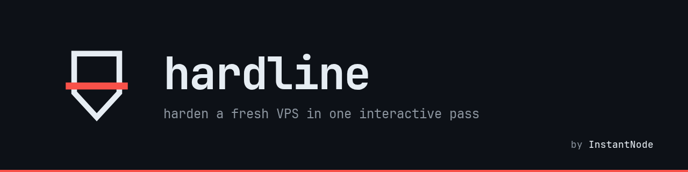
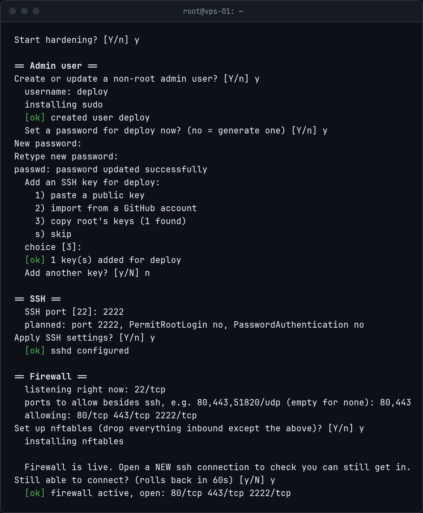
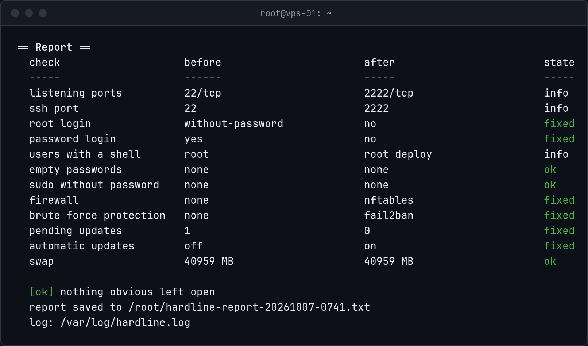

<p align="center"></p>

<p align="center">
  
  
  <a href="https://github.com/instantnodeeu/hardline/releases"></a>
  <a href="https://github.com/instantnodeeu/hardline/stargazers"></a>
  <a href="https://instantnode.eu"></a>
</p>

hardline takes a fresh VPS from "root with a password on port 22" to something
you can leave on the internet. It's one bash script that asks before every
change, and at the end it shows you what was open before and what is closed now.

```sh
curl -fsSL https://raw.githubusercontent.com/instantnodeeu/hardline/main/hardline.sh | sudo bash
```

Piping into bash still works interactively, questions are read from `/dev/tty`.
If you'd rather read it first (you should):

```sh
curl -fsSLO https://raw.githubusercontent.com/instantnodeeu/hardline/main/hardline.sh
less hardline.sh
sudo bash hardline.sh --dry-run
```

<p align="center"></p>

## What it does

Every step can be skipped. In order:

1. **Audit.** Listening ports, effective sshd settings, users with a login shell,
   empty passwords, passwordless sudo, firewall, fail2ban/crowdsec, pending
   updates, automatic updates, swap.
2. **Admin user.** Creates a sudo user (or fixes up an existing one), sets a
   password and adds SSH keys. Keys can be pasted, pulled from
   `github.com/<name>.keys` or copied from root. The `command="..."` prefix that
   cloud images put on root's keys is stripped.
3. **SSH.** Writes `/etc/ssh/sshd_config.d/00-hardline.conf`: root login off,
   password login off, optionally a different port. Password login is only
   turned off if a user with a working key exists, and the config is checked
   with `sshd -t` before reload. It asks you to test a second login and rolls
   back if that fails. Handles Ubuntu's `ssh.socket` and SELinux port labels.
4. **Firewall.** Uses ufw or firewalld if they're already running. Otherwise it
   writes an nftables table `inet hardline` that drops everything inbound except
   SSH and the ports you list. You get 60 seconds to confirm you can still
   connect, after that the rules are removed again.
5. **Brute force.** fail2ban (default) or crowdsec with the nftables bouncer.
   fail2ban gets the right backend for systems without `/var/log/auth.log`.
6. **Updates.** Installs pending updates, then sets up unattended-upgrades,
   dnf-automatic or a daily `apk upgrade`. Arch gets a reminder instead.
7. **Swap.** If there is none: a swapfile sized by RAM, btrfs aware, plus
   `vm.swappiness = 10`.
8. **Time and sysctl.** Timezone, NTP, and a few network sysctls (syncookies,
   loose rp_filter, no redirects, no source routing).
9. **Report.** Before/after table in the terminal and in
   `/root/hardline-report-<date>.txt`.

<p align="center"></p>

## Supported systems

| Family | Tested on | Notes |
| --- | --- | --- |
| Debian / Ubuntu | Debian 12, Ubuntu 24.04 | |
| RHEL | AlmaLinux 9 | Rocky, CentOS Stream and Fedora should work, fail2ban comes from EPEL |
| Arch | Arch Linux | no automatic updates on purpose |
| Alpine | Alpine 3.2x | needs `apk add bash curl` first, OpenRC |
| openSUSE | | best effort |

So far every run has been in containers without an init system (Debian 12,
Ubuntu 24.04, AlmaLinux 9, Arch, Alpine, each once with `--dry-run` and twice
for real). That covers package installs, config files, the sshd check, the
nftables ruleset and the report. Enabling services under systemd/OpenRC, the
sshd reload and crowdsec haven't been exercised on a real VM yet. Reports from
real machines are welcome.

## Options

| Flag | |
| --- | --- |
| `-y`, `--yes` | don't ask, use flags and defaults |
| `-n`, `--dry-run` | print what would change, change nothing |
| `--audit` | only print the audit |
| `--user NAME` | admin user to create or update |
| `--key "KEY"` | public key for that user |
| `--github NAME` | import keys from `github.com/NAME.keys` |
| `--copy-root-keys` | copy root's `authorized_keys` |
| `--ssh-port PORT` | move sshd |
| `--allow LIST` | extra ports, e.g. `80,443,51820/udp,8000-8100` (tcp if no protocol) |
| `--brute TOOL` | `fail2ban`, `crowdsec` or `none` |
| `--no-updates` | skip the updates step |
| `--swap SIZE` | `2G`, `1024M`, or `no` |
| `--timezone TZ` | e.g. `Europe/Berlin` |
| `--skip LIST` | any of `user,ssh,firewall,bruteforce,updates,swap,extras` |
| `--no-color` | plain output (also respects `NO_COLOR`) |

Non-interactive example for provisioning:

```sh
sudo bash hardline.sh --yes --user deploy --github yourname --ssh-port 2222 --allow 80,443
```

With `--yes` the admin user step is skipped unless `--user` is given, and SSH
password login stays on if no key can be found.

## Files it touches

Every file it changes is copied to `<file>.hardline.bak` first (only once, so
the backup is always the original). Everything is logged to
`/var/log/hardline.log`.

```
/etc/ssh/sshd_config.d/00-hardline.conf
/etc/ssh/sshd_config                      Include line, old Port line commented out
/etc/hardline/firewall.nft
/etc/nftables.conf                        /etc/sysconfig/nftables.conf on RHEL, /etc/nftables.nft on Alpine
/etc/fail2ban/jail.d/hardline.local
/etc/apt/apt.conf.d/20auto-upgrades       52hardline-reboot if you opt in
/etc/periodic/daily/hardline-apk-upgrade
/etc/sudoers.d/10-hardline-wheel          Arch and Alpine only
/etc/sysctl.d/90-hardline.conf
/etc/sysctl.d/90-hardline-swap.conf
/etc/fstab, /swapfile
```

Running it twice is fine, it only rewrites what differs.

## Undo

```sh
# ssh
rm /etc/ssh/sshd_config.d/00-hardline.conf
cp -a /etc/ssh/sshd_config.hardline.bak /etc/ssh/sshd_config
systemctl reload ssh    # or sshd

# firewall
nft delete table inet hardline
cp -a /etc/nftables.conf.hardline.bak /etc/nftables.conf   # or rm it if there is no .bak

# fail2ban
rm /etc/fail2ban/jail.d/hardline.local && systemctl restart fail2ban

# swap
swapoff /swapfile && rm /swapfile && sed -i '/^\/swapfile /d' /etc/fstab
```

The admin user and installed packages stay.

## Things to know

- Docker publishes ports through the forward chain, so the input rules here
  don't cover them. Bind containers to `127.0.0.1` or use `DOCKER-USER`.
- Debian's `nftables.service` runs `nft flush ruleset` when stopped, which also
  wipes Docker's rules. Restart Docker after stopping it.
- Keep your current SSH session open until you've logged in a second time.
- In containers without an init system, service steps are skipped. Useful for
  testing, not much else.

## License

MIT, see [LICENSE](LICENSE). Made by [InstantNode](https://instantnode.eu).
